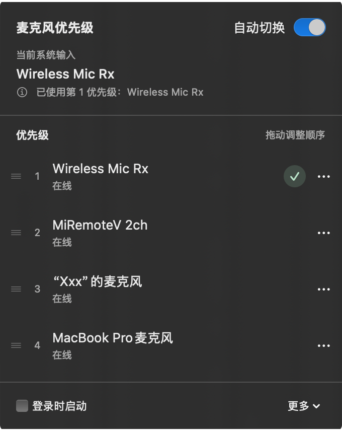

<p align="center"></p>
<h1 align="center">MicPriority</h1>
<p align="center">Set microphone priorities. Let the next input take over when one disconnects.</p>
<p align="center"><a href="README.md">简体中文</a> · <strong>English</strong></p>
<p align="center">
  <a href="https://github.com/NotWizard/MicPriority/releases/latest"></a>
  
  
  <a href="LICENSE"></a>
</p>

MicPriority is a native macOS menu bar utility. Rank your preferred microphones, switch to the next available input when the current one becomes unavailable, and return when a higher-priority input recovers. There is no main window, and the app does not record or save audio.

## Why this tool exists

MicPriority began with a recurring frustration during AI coding and vibe coding. Voice input makes it convenient to describe an idea or a change to an AI assistant, and a dedicated wireless microphone can help make that input clearer.

The transmitter gets turned off and back on, while its receiver often stays plugged into the Mac. Even with the transmitter off, macOS may keep the receiver selected as its input. The next time you start speaking, nothing comes through, so you have to open sound settings and switch microphones manually. Turning the microphone back on can mean another trip to those settings.

**MicPriority exists to remove that repeated interruption.** Set your preferred input order once, let an available microphone take over, and return when your preferred microphone recovers, so you can stay focused on explaining ideas and writing code. For a receiver that remains online while its transmitter is disconnected, dedicated support currently covers the DJI and Xiaomi remote setups listed below.

## Download and install

**[Download the latest release](https://github.com/NotWizard/MicPriority/releases/latest)** · macOS 13 or later, **Apple Silicon (M-series) only**.

1. Download and extract `MicPriority-0.3.1-macOS-apple-silicon.zip`.
2. Move `MicPriority.app` to Applications and open it.
3. Click the P microphone icon in the menu bar to configure your priorities.

> This release uses an ad-hoc local signature and is not notarized by Apple. macOS may block the first launch. Only if you trust the download source, follow [Apple’s instructions](https://support.apple.com/102445): try opening the app, then use System Settings → Privacy & Security → Open Anyway. You do not need to disable system security protections.

Starting with v0.3.0, builds, downloads and in-app updates target Apple Silicon only.

## Check for updates

Choose “更多 → 检查更新…” to check the latest stable GitHub Release. If an update is available, select “下载更新”, then “安装并重启” after the download and verification finish. Your priorities and settings are preserved. Cancelling or a failed download or verification leaves the current app in place.

Keep the app in a writable local folder, preferably Applications. If its location cannot be updated, the app explains why and offers a link to the release page for manual installation. Checks only happen when you request them.

v0.2.1 has no update menu. Install v0.3.0 or later manually once to enable future in-app updates.

## Screenshot

<p align="center"></p>

Captured from the app running on a real Mac, with its actual device order and system input state. Update checking is in the “更多” menu. The app interface currently uses Chinese.

## How to use it

1. **Add your inputs.** Choose “加入” under “其他输入”. Put the built-in microphone last as a fallback.
2. **Set the order.** Drag the handle on a row, or use “上移／下移” in its menu. Ordering is saved when you drop.
3. **Enable automatic switching.** An unavailable input is skipped. A higher-priority input takes over after roughly two seconds of stable recovery.

| Action or state | Result |
|---|---|
| Current system input | Only that row has a checkmark with a soft green background; numbers show priority |
| Select another input | Use it temporarily for 30 minutes while automatic mode is enabled, without changing priority order |
| Select the highest available ranked input | End the temporary override and continue automatic routing |
| Disable automatic mode | Selecting an input performs a single switch; external choices are left alone |
| A device disconnects | Keep its saved position and skip it; new devices must be added explicitly |
| Launch at login | Enable it at the bottom of the popover; approval status reflects macOS |

Automatic routing starts disabled. Meeting and recording apps should use **System Default** as their input. Apps pinned to a particular device may ignore system changes, and an active recording session may not migrate immediately.

## Supported inputs

### Xiaomi remotes and SayAll

[SayAll](https://github.com/HD838A/remote-mic-app) is a separate project that turns compatible Xiaomi Bluetooth voice remotes into wireless microphones for the Mac, delivering audio through the `MiRemoteV 2ch` virtual input. Set up and connect your remote in SayAll first, then add that input to your MicPriority list.

The virtual input can remain listed in macOS even after the remote disconnects. MicPriority supports this setup by checking the remote’s Bluetooth connection and whether SayAll is running. Another microphone takes over when the source disconnects, and the preferred input returns after stable recovery. SayAll and its audio plugin are installed separately; neither is bundled with MicPriority.

### Availability rules

| Input | Availability rule and boundary |
|---|---|
| General microphones | System-reported availability and input capability |
| DJI Mic Mini / Mic Mini 2 receiver | Compatible v2 status protocol; skip the receiver when no usable transmitter is linked. Physical verification currently covers DJI Mic Mini 2 |
| MiRemoteV 2ch + Xiaomi remote + SayAll | Bound remote Bluetooth connection and SayAll running state; the virtual input remains listed in macOS after disconnection but is skipped by MicPriority |

**Mute, quiet audio and pauses in speech do not trigger switching.**

- An unreadable DJI status or more than two seconds without valid updates makes the receiver temporarily unavailable. Other firmware is not guaranteed compatible.
- Initial Xiaomi discovery recognizes `MI RC`, `Xiaomi Bluetooth Remote 2`, `Xiaomi Bluetooth Remote 2 Pro` and “小米蓝牙语音遥控器”. Once the identity is stored locally, later system renaming still matches it. A remote renamed before first discovery needs a supported name restored first.
- A Bluetooth connection does not prove SayAll’s audio pipeline is healthy. The MiRemoteV rule does not track phone, web or Apple Watch sources.
- Charging-case behavior, two DJI transmitters, radio range loss, battery depletion and in-session migration in target apps still need their own physical checks.

## Privacy

No microphone audio capture and no device-identity uploads. User-initiated update checks and downloads contact GitHub without sending device lists or microphone settings. Device UIDs and Xiaomi Bluetooth identities stay in local settings for stable matching; copied diagnostics use UID hashes. If macOS asks for Bluetooth permission, it is for connection metadata, not pairing or reconnecting devices.

## Build from source

Swift 5.9 or later and Apple Command Line Tools are sufficient.

```sh
git clone https://github.com/NotWizard/MicPriority.git
cd MicPriority
./scripts/build.sh
open dist/MicPriority.app
```

The build script produces an Apple Silicon (arm64) app only.

The script generates the menu bar vector PDF and App icons, then validates the local signature. The public package is not notarized. Maintainers with a Developer ID can set `MIC_PRIORITY_SIGN_IDENTITY` and complete notarization separately.

## Development and verification

```sh
swift run RoutingChecks
```

Live checks temporarily change the system input and attempt restoration. Quit the normal MicPriority instance first, and avoid running them during important calls or recordings.

```sh
swift run RoutingChecks --live-switch
dist/MicPriority.app/Contents/MacOS/MicPriority --check-controller
dist/MicPriority.app/Contents/MacOS/MicPriority --check-dji-flow
dist/MicPriority.app/Contents/MacOS/MicPriority --check-miremote-flow
```

Follow console prompts for physical transmitter or remote actions. Further commands, timing parameters and validation boundaries are in the [development notes](docs/development.md) and [hardware verification record](docs/verification.md) (Chinese).

## Protocol references and license

No third-party executable dependencies. The unofficial DJI status protocol is informed by [DJI Mic Control](https://github.com/ShadowBitBasher/DJI-Mic-Control/blob/main/PROTOCOL.md) and [MicShift’s interoperability record](https://github.com/dvnkshl/MicShift/blob/main/DJI_USB_CAPABILITIES.md). The native implementation reads status only; it sends no settings commands and does not seize USB interfaces.

[MIT](LICENSE) · Copyright 2026 NotWizard.
