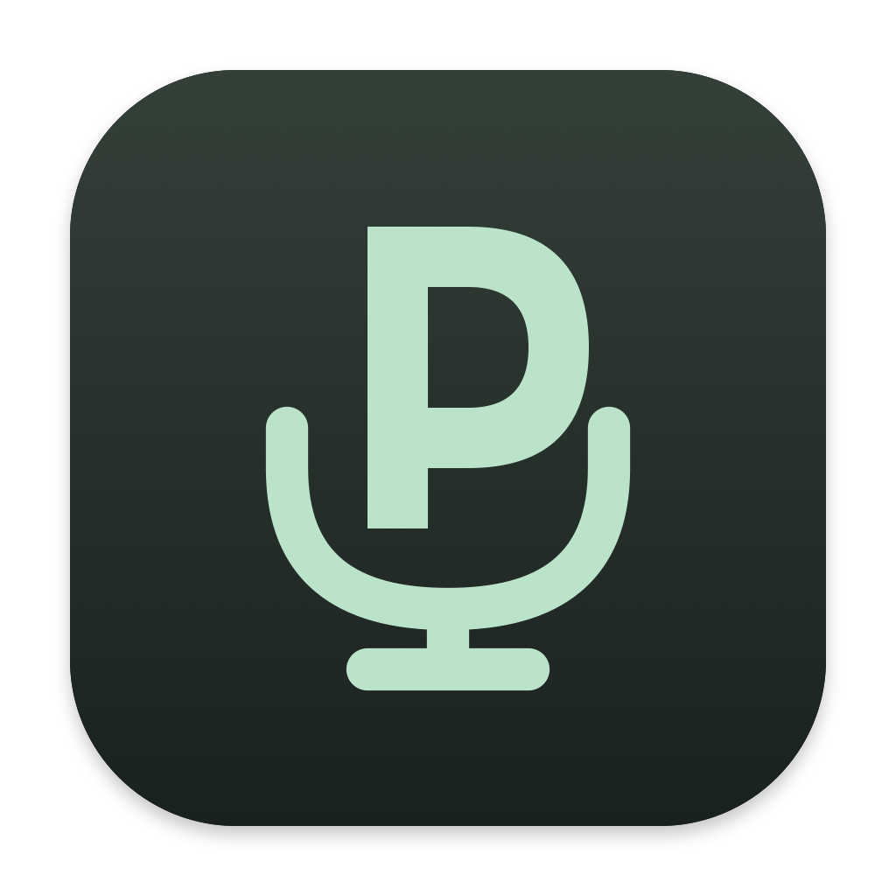

# MicPriority · 麦克风优先级

原生 macOS 菜单栏应用。给麦克风安排固定优先级，在当前输入不可用时选择下一支；高优先级输入稳定恢复后自动切回。没有主窗口或 dashboard，不采集或保存音频。

## 使用

1. 点击菜单栏的 P 麦克风图标，将常用输入加入优先级。
2. 拖动调整顺序，也可以在每行菜单里上移、下移。建议把内置麦克风放到末尾。
3. 开启自动切换。当前实际系统输入以原生单选圆点显示，优先级数字表示排序。

点击其他麦克风可临时使用 30 分钟；点击最高可用优先级，即结束临时选择并继续自动管理。暂停自动切换后，点击设备只执行一次切换。首次启动默认暂停；新设备需要主动加入列表，离线设备保留原位置。

应用修改 macOS **系统默认输入**。会议或录音软件应选择“系统默认”；固定绑定设备的软件、已打开且不支持迁移的录音会话可能不跟随。

## 型号支持

- 通用输入：Core Audio 设备状态、输入通道与默认输入能力。
- DJI Mic Mini / Mic Mini 2 接收器：USB `2ca3:4011` 的 v2 状态协议；没有已连接且未充电的发射器时跳过。状态不可读或超过 2 秒未收到有效状态时也跳过。当前真机验证为 DJI Mic Mini 2，其他固件未保证兼容。
- MiRemoteV 2ch：按已绑定的小米遥控器蓝牙状态与 SayAll 运行状态判断。断联时该虚拟输入仍存在于系统列表，但在本工具中不可用。该规则针对小米来源，尚不追踪 SayAll 的手机、网页或 Apple Watch 来源。

静音、低音量、长时间不说话不会触发切换。蓝牙状态只证明连接，不证明 SayAll 内部音频通道正常。DJI 充电盒、双发射器、射频超距、电池耗尽和会议软件会话内迁移仍需要对应实物验证。

首次识别小米遥控器时支持名称 `MI RC`、`Xiaomi Bluetooth Remote 2`、`Xiaomi Bluetooth Remote 2 Pro` 和“小米蓝牙语音遥控器”；身份只在本地保存，后续改名仍按身份匹配。若系统要求蓝牙权限，请允许本工具读取连接状态。首次识别前已任意改名的遥控器需要先恢复受支持的名称。

## 构建

需要 macOS 13+ 和 Swift 5.9+，Apple Command Line Tools 即可。

```sh
git clone https://github.com/NotWizard/MicPriority.git
cd MicPriority
./scripts/build.sh
open dist/MicPriority.app
```

构建脚本生成菜单栏矢量 PDF、完整 App 图标 ICNS，并打包到应用中。默认使用本机 ad-hoc 签名，未进行 Apple 公证。对外发行需使用 Developer ID 签名并完成公证；可通过 `MIC_PRIORITY_SIGN_IDENTITY` 指定已有签名身份。

## 验证

```sh
swift run RoutingChecks
swift run RoutingChecks --live-switch
dist/MicPriority.app/Contents/MacOS/MicPriority --check-controller
```

运行实际切换检查前请先退出常规 MicPriority 实例，以免同时管理输入或占用 DJI 状态接口。后两项临时改变实际默认输入，完成或失败时尝试恢复原选择。不要在重要通话或录音时运行。控制器检查使用独立配置，不覆盖正常优先级。

```sh
# DJI：先关闭所有发射器，按控制台提示开机、关闭。
dist/MicPriority.app/Contents/MacOS/MicPriority --check-dji-flow
# 小米：开始前连接遥控器，按提示断联、重连。
dist/MicPriority.app/Contents/MacOS/MicPriority --check-miremote-flow
# 小米：保持断联，验证误选该输入时会自动纠正。
dist/MicPriority.app/Contents/MacOS/MicPriority --check-miremote-flow --verify-disconnected
# 只读查看设备状态。
dist/MicPriority.app/Contents/MacOS/MicPriority --list-inputs
```

程序可渲染自己的 SwiftUI/AppKit 面板，不控制桌面、不启用自动切换：

```sh
dist/MicPriority.app/Contents/MacOS/MicPriority --render-preview /absolute/path/panel.png
```

时间校准键为 `recoveryDelaySeconds`（默认 2）、`confirmationTimeoutSeconds`（1.5）、`temporaryDurationSeconds`（1800），通过应用的 UserDefaults 设置，重启生效。设备身份留在本地配置；诊断只输出 UID 摘要。

## 实现

SwiftUI 菜单栏场景、AppKit 原生拖拽空位与单选控件、Core Audio、IOUSBHost、IOBluetooth、ServiceManagement。无第三方依赖。图标的确定性矢量几何源位于 `BrandArtwork.swift`，构建时自动生成不同尺寸。

DJI 专用协议参考 [DJI Mic Control](https://github.com/ShadowBitBasher/DJI-Mic-Control/blob/main/PROTOCOL.md) 与 [MicShift 的互操作记录](https://github.com/dvnkshl/MicShift/blob/main/DJI_USB_CAPABILITIES.md)，为非官方协议。原生实现只读取状态，不发送设置命令，不抢占 USB 接口。真实设备包确认 CRC-8 seed 为 `0x77`，已经纳入检查。

详细边界与现场结果见 [验证记录](docs/verification.md)。

## 许可证

[MIT](LICENSE) · Copyright 2026 NotWizard。
