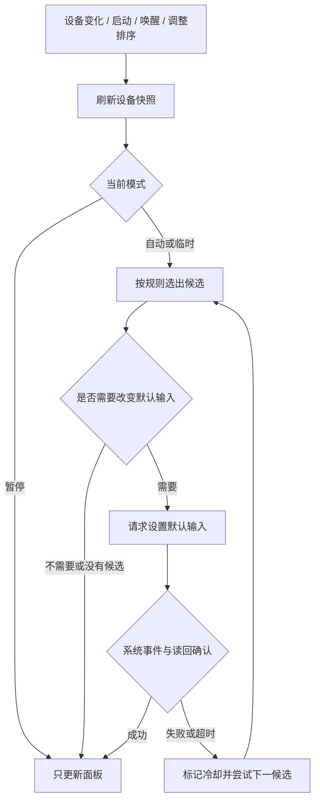

这份方案面向一个原生 macOS 菜单栏工具，暂称“麦克风优先级”。核心行为是：你保存一个输入设备顺序，软件持续选择其中优先级最高、系统报告可用的设备；当前设备断开时，选择下一支。所有日常操作都在菜单栏弹出面板内完成。

以下给出建议默认行为、实现方式和验收条件。故障类型、恢复时机和手动模式时长尚待按实际使用确认；本文先明确覆盖设备断连，并把“接收器在线但无声”作为独立能力边界。

**产品成立的两个前提。**

第一，需要把“设备不可用”和“录不到声音”分开。Core Audio 的 DeviceIsAlive 描述系统认为设备是否 ready/available；它不证明发射器电量、无线链路或声音信号正常。USB 接收器保持连接而发射器关闭、没电或失联时，设备可能仍被报告在线。这个判断依据 Apple SDK 的 AudioHardwareBase.h 对相关属性的定义。

第二，工具管理的是系统默认输入。目标应用如果独立选择了具体设备，或者只在开始录音时读取默认输入，就可能不跟随中途切换。只有完成真实应用的录音或通话测试，才可以报告该应用支持自动切换。

| 情况 | 第一版处理 | 成功边界 |
|---|---|---|
| USB 输入拔掉或蓝牙输入消失 | 按优先级自动兜底 | 依据系统设备变化事件 |
| 设备仍存在，但系统明确报告不可用 | 跳过该设备 | 依据可读取的设备状态 |
| 设置默认输入失败 | 短暂冷却该候选，尝试下一支 | 等待事件并读回确认 |
| 接收器在线，发射器关闭或没电 | 通用第一版无法可靠识别 | 需要型号提供确定的链路状态 |
| 没有说话、音量很低、用户静音 | 保持当前选择 | 不把安静或静音等同于故障 |
| 应用固定选择另一支麦克风 | 提示该应用的路由设置要求 | 系统默认输入无法保证接管 |

**一张面板完成操作。**

菜单栏使用单色麦克风图标，tooltip 显示当前系统输入与模式。正常自动管理、临时使用、暂停及异常分别使用简洁符号和文字说明，避免用颜色作为唯一信息，也避免把“在线”显示成“正在录音”。

面板建议宽度约 340 pt，以原生系统字体、原生控件和随系统变化的浅色/深色外观呈现。四个设备通常一屏显示，较长列表滚动；名称过长时截断并允许查看全名。面板点击外部或按 Esc 关闭。

```text
麦克风优先级                    自动切换 [开]
当前系统输入：MacBook Pro 麦克风
Wireless Mic Rx 已断开，已使用第 2 优先级

优先级                    拖动调整顺序
≡  1  Wireless Mic Rx                 离线
≡  2  MacBook Pro 麦克风          ✓   在线

其他输入
   “Xxx”的麦克风                    [加入]
   MiRemoteV 2ch                    [加入]

登录时启动 [开]                       更多 ▾
```

此处顺序只是基于截图设备的示例。首次运行先展示设备，用户加入常用输入、调整顺序，再启用自动切换；配置完成前不改写系统输入。对于有内置麦克风的 Mac，建议将它加入并放在最后。没有内置麦克风的机器，需要选择自己的兜底输入。

操作定义如下：

- 拖动已加入的设备，改变持久化优先级；落下后保存并重新计算目标。行中勾选表示当前系统默认输入，数字表示优先级，两者含义分开。
- 设备离线后保留原位置，恢复连接后回到该位置。用户可以通过行菜单移出优先级；移出后的在线设备出现在“其他输入”。
- 新发现的设备先出现在“其他输入”，点击“加入”后追加到优先级末尾。它不会仅因新连接就获得自动选择资格。
- 点击在线设备，明确执行“临时使用此输入 30 分钟”。不改变排序，面板显示剩余时间及“恢复自动”；期限到、目标断开或应用重新启动后恢复自动。30 分钟为建议值，实施前可按使用习惯调整。若本来已暂停自动管理，点击设备只执行一次切换，保留暂停状态。
- 关闭自动切换后只更新设备和当前输入信息，不再改写默认输入。想在系统声音菜单里持续手动选择时，可先暂停自动管理。
- “更多”放置恢复自动、复制诊断信息、关于及退出；常用设置直接留在本面板。退出后保留当时的系统输入。
- 排序同时提供“上移/下移”操作，支持键盘和 VoiceOver；离线项仍可排序和移除，不能被临时选中。

自动回退成功时，默认只更新 tooltip 和面板内的最近原因。无可用候选、设置失败或检测到反复争抢时显示异常标记；不为每次成功切换弹通知。

**自动选择规则。**

候选必须同时满足：已加入优先级、当前可枚举、输入通道数大于 0、DeviceIsAlive 为 1、输入 scope 允许作为默认设备、状态读取成功且不在本轮失败冷却内。状态未知的设备显示“状态未知”，不宣称可用。DeviceIsRunning 为 0 常常只是没人正在录音，不能作为故障条件。

正常自动模式下，遍历保存的顺序，取第一个满足条件的设备。临时使用模式先检查临时目标；若它断开或期限已到，清除临时目标并恢复正常规则。暂停模式不执行自动写入。

建议时序采用：普通变化合并约 150 ms；当前输入已明确消失时立即安排评估；较高优先级设备恢复后，等待连续约 2 秒可用再切回。这些是开发时可调的参数，不是所有设备的性能保证。切换确认时限建议先设 1.5 秒，并在真实硬件上校准。

| 事件 | 建议行为 |
|---|---|
| 第一优先级断开 | 选择下一支可用候选 |
| 第一优先级恢复 | 稳定约 2 秒后切回，临时模式下不抢回 |
| 第二支也断开 | 继续向后查找 |
| 调整顺序或恢复自动 | 重新选择最高可用候选 |
| 所有候选都不可用 | 显示实际系统输入及“无可用候选”，不设置未知设备 |
| 系统或别的应用改写默认输入 | 自动模式重新评估优先级；无法仅凭事件判定是否人为操作 |
| 反复被外部改写 | 触发冲突保护，暂停管理，显示“恢复自动” |
| Mac 睡眠后唤醒 | 丢弃旧运行时 ID，重新枚举、恢复监听，再评估 |



**原生实现结构。**

建议使用 Swift、SwiftUI 和 Core Audio，目标版本 macOS 13 起。菜单栏入口直接使用 MenuBarExtra，采用 .window 样式承载排序列表和开关；应用只定义菜单栏场景，设置 LSUIElement = true。Apple 官方文档明确支持仅在菜单栏存在的工具，以及承载标准控件的弹出面板。[MenuBarExtra](https://developer.apple.com/documentation/swiftui/menubarextra)

排序先使用 SwiftUI List/ForEach 的 onMove，保留上移/下移作为明确且可访问的操作；在目标系统验证菜单栏面板中的拖动、点击和焦点行为。如果这套标准控件不能满足真实验证，再局部使用 AppKit 的列表控件，不预先搭两套 UI。[onMove](https://developer.apple.com/documentation/swiftui/dynamicviewcontent/onmove(perform:))

| 文件职责 | 内容 |
|---|---|
| MicPriorityApp.swift | 菜单栏场景、图标和应用生命周期 |
| InputMenuView.swift | 输入列表、排序、临时选择、开关和菜单 |
| AudioDevices.swift | Core Audio 枚举、状态读取、属性监听和默认输入写入 |
| InputController.swift | 优先级规则、临时模式、恢复延迟、失败与冲突保护、配置保存 |

第一版保持一个应用 target 和一个进程。配置与模型可以留在控制器文件内；不为这几个职责建立插件系统、依赖注入框架、数据库、后台 helper 或网络服务。

Core Audio 调用对应关系：

| 要完成的事 | 属性或 API |
|---|---|
| 列出设备 | kAudioHardwarePropertyDevices |
| 判断它是否有输入通道 | kAudioDevicePropertyStreamConfiguration，input scope，累计通道数 |
| 取得持久身份 | kAudioDevicePropertyDeviceUID |
| 名称和连接类型 | kAudioObjectPropertyName / kAudioDevicePropertyTransportType |
| 读取系统可用性 | kAudioDevicePropertyDeviceIsAlive |
| 是否可作为默认输入 | kAudioDevicePropertyDeviceCanBeDefaultDevice，input scope |
| 获取或设置默认输入 | kAudioHardwarePropertyDefaultInputDevice |
| 收到属性变化 | AudioObjectAddPropertyListenerBlock |
| 写入属性 | AudioObjectSetPropertyData |

默认输入是 AudioSystemObject 的全局属性；读设备通道等信息时则使用对应设备及 input scope。运行时 AudioDeviceID 只用于当次 Core Audio 调用，排序和记录必须使用 UID。Apple SDK 将 UID 定义为跨启动持久的标识；驱动重装、设备固件或个别驱动的识别方式仍需实际验证。如果 UID 变了，先视为新设备，由用户确认，不能仅按名称自动合并。

通过设备列表变化增删每设备监听；监听系统默认输入、设备存活状态和输入流配置变化。启动采用注册系统监听后获取快照，再做一次一致性评估的流程，以缩小初始化期间漏事件的窗口。额外处理 NSWorkspace 的睡眠/唤醒通知，以及 Core Audio 服务重启事件。唤醒或服务重启时重新枚举、重建监听；必要时进行少量有上限的延迟重扫。

属性监听与 Core Audio 操作统一串行处理，UI 状态在主线程发布。回调不执行音频采集、UI绘制或长任务。移除监听时使用匹配的对象、地址、队列和 block，防止回调残留或引用循环。[AudioObjectAddPropertyListenerBlock](https://developer.apple.com/documentation/coreaudio/audioobjectaddpropertylistenerblock(_:_:_:_:))

**切换必须有确认与失败出口。**

AudioObjectSetPropertyData 返回成功，不等于属性已经改变。Apple 明确说明许多属性异步生效，应在 HAL 回调后判断实际变化。控制器应显示“正在切换”，等默认输入变化事件到来后读回 UID，确认与目标一致，再显示成功。[AudioObjectSetPropertyData](https://developer.apple.com/documentation/coreaudio/audioobjectsetpropertydata(_:_:_:_:_:_:))

执行链如下：

1. 获取最新快照，并检查目标仍满足候选条件。
2. 若实际默认输入 UID 已与目标相同，结束；否则检查属性可写，发起一次设置。
3. 记录本次请求的目标 UID、序号与确认截止时间。一次只保留一个切换请求；新状态使旧结果过期时，重新评估最新目标。
4. 等待事件并读回实际默认输入。不能使用“忽略下一次回调”的做法，因为自发回调与外部变化可能交错。
5. 写入错误或确认超时后刷新快照，最多再尝试一次；仍失败则把目标暂时冷却，例如 30 秒，并尝试下一候选。冷却结束时安排一次恢复评估，仍失败则等该设备重新连接、服务恢复或用户重试，不持续循环尝试。
6. 此轮每个候选的尝试次数有上限。所有候选失败后停止本轮，显示实际系统输入及错误；只允许上述有限恢复检查，以及后续真实设备变化或用户重试触发新一轮。

自身设置成功的回调不会触发再次写入。默认输入持续被其他来源改回时，建议以“10 秒内出现 3 次确认的外部覆盖”为初始冲突保护阈值，暂停自动管理并展示原因；阈值需硬件测试校准。全局暂停与冲突暂停在 UI 内说明原因，用户可恢复自动。只有触发变化、恢复检查和失败重试才安排短定时任务，不用每秒常驻轮询。

**本地配置、启动与权限。**

使用 UserDefaults 保存版本号、自动管理是否启用，以及按顺序保存的 { uid, lastKnownName } 数组。顺序本身就是优先级，不再保存重复的 rank 字段。临时模式、恢复等待和失败冷却保持为运行时状态；应用重启后清除，按保存的自动管理开关恢复。应用不把动态在线状态持久化。

登录启动使用 SMAppService.mainApp.register()/unregister()。开关展示实际注册状态；若系统要求批准，显示“等待系统批准”并提供打开对应系统设置的入口。只注册当前应用即可，Apple DTS 明确说明无需为此增加一层 helper。[SMAppService.mainApp](https://developer.apple.com/documentation/servicemanagement/smappservice/mainapp) · [Apple DTS 说明](https://developer.apple.com/forums/thread/777520)

第一版仅操作设备元数据和默认输入属性，不创建采集会话，也不录制音频。按此方案，麦克风录音授权、辅助功能授权和管理员权限都不应成为基础功能的前置条件；实施时必须在未授予麦克风权限的状态下验证。登录启动仍遵循系统自己的批准机制。

若后续加入信号检测，必须先提供明确的录音用途说明、所需 entitlement 与用户授权；拒绝授权时基础排序和切换仍可用。即使不保存声音，只在内存计算音量，也属于麦克风采集，可能点亮系统录音指示。[Apple 媒体授权说明](https://developer.apple.com/documentation/avfoundation/requesting-authorization-to-capture-and-save-media)

错误与切换原因使用本地 OSLog；仅记录事件和状态，不记录音频。面板保留最近一次原因。“复制诊断信息”由用户主动触发，包含系统版本、设备类型、当前模式、最近失败及已脱敏的设备标识即可。

**接收器在线但发射器失效的后续方案。**

若这正是最常见故障，应在 UI 开发前验证设备型号的可观测性，而不是等第一版完成才发现问题仍存在。

优先寻找厂家公开且支持 macOS 的接收链路状态接口、控制通道或设备属性。只有能读到确定的发射器断连等信号，才能把它加入候选可用性条件。接口是否存在和是否可靠是调查结论，不能先假定有 SDK；型号专用支持也不能声称适用于所有无线麦克风。

没有确定状态时，连续安静无法区分发射器关闭、用户沉默和静音。可选的信号辅助检测可以提供“当前输入长时间无信号，请检查”的提示，或让用户说话后进行一次诊断。第一版不因静音或音量小自动换麦克风。基于声音能量的自动切换即使做阈值校准，也必须清楚标为有误判的实验功能，不能当作断连检测的等价实现。

如果还要求固定设备的应用在会话内透明迁移，则需另行评估稳定的虚拟输入设备和音频路由方案，并让应用选择该虚拟输入。它会扩大采集、驱动安装、签名及格式兼容工作；而且仍不自动解决接收器无声的诊断问题。

**开发和交付顺序。**

1. 先做真实硬件验证：枚举截图中的输入、测试读取状态和设置默认输入，分别测试拔掉接收器与只关闭发射器；同时在主要使用的应用里验证是否跟随切换。输出明确的支持表和故障边界。
2. 完成菜单栏产品：优先级加入/移除、排序、断开兜底、稳定恢复、临时使用、开关、持久化与登录启动。把策略写成可直接输入设备快照和时间的函数，保持一个小型策略测试目标，覆盖真正的行为分支。
3. 补齐恢复与错误出口：睡眠/唤醒、服务重启、设备重枚举、异步确认、失败冷却、外部争抢、键盘与 VoiceOver。使用实际麦克风和主要应用完成回归。
4. 交付一个本地 .app。个人开发测试阶段用本机构建；对外安装版本采用 Developer ID 签名、Hardened Runtime 和公证。验证签名、首次启动及登录启动行为，再发布压缩包或 DMG。[Apple 公证说明](https://developer.apple.com/documentation/security/notarizing-macos-software-before-distribution)

第一版工作集中在选择规则与真实设备兼容性。自动更新、跨设备配置同步、声学质量评分、会议识别和独立设置窗口都可以等有明确需求再增加。

**验收应证明这些行为。**

| 测试 | 必须看到的结果 |
|---|---|
| A/B/C 都在线 | 自动模式最终默认输入为 A |
| 拔掉 A，再拔掉 B | 顺序退到 B、C；读回系统输入一致 |
| A 恢复并短暂反复断连 | 达到稳定窗口后才提升，不反复跳转 |
| 增加未加入的 D | 显示在其他输入，不获得自动选择资格 |
| 两支同名设备、设备重枚举 | 用 UID 区分，原排序不按名称串线 |
| 临时选择 B | A 保持在线也不立即抢回；期限、断连或重启按规则结束临时模式 |
| 暂停后系统手动切换 | 工具不再主动改写默认输入 |
| 用户静音或保持沉默 | 不因此换成另一支输入 |
| setter 返回成功但未生效，或目标途中消失 | 不误报成功，确认失败后有限重试并兜底 |
| 全部候选离线或全部设置失败 | 本轮停止，显示实际输入和异常，不写未知 ID |
| 另一工具持续改写输入 | 命中冲突保护，停止争抢并允许用户恢复 |
| 睡眠/唤醒、登录、Core Audio 服务重启 | 重建运行时状态与监听，保存的顺序有效 |
| USB 接收器仍在线但发射器关闭 | 记录系统是否可见该故障，不把 DeviceIsAlive 误当作信号证明 |
| 目标应用使用系统默认与固定设备两种设置 | 分别验证正在进行的录音是否迁移，支持结论按应用记录 |
| 蓝牙耳机参与排序 | 检查切换稳定性和可能的通信模式/音质变化 |
| 未授予录音权限 | 基础列表、排序、断连管理可用且不打开音频采集 |
| 应用重新启动 | 顺序与自动管理开关恢复，临时模式清除 |
| 浅色/深色、长名称、键盘、VoiceOver | 状态和当前输入可辨识，排序不依赖鼠标拖动 |

选择逻辑测试与硬件测试都需要。只验证“系统设置显示新麦克风”，无法证明通话对方实际已经收到新输入。软件自身只写默认输入属性，不主动写输出属性；蓝牙设备可能因输入选择改变通信模式，因此仍应验证输出体验。

落地前最重要的判定是：你的故障是否会让设备从 macOS 消失或被明确标为不可用。如果会，这个小型原生工具能够直接覆盖；如果接收器一直在线而无线端失效，必须先确认具体硬件是否公开可读取的失效状态。
